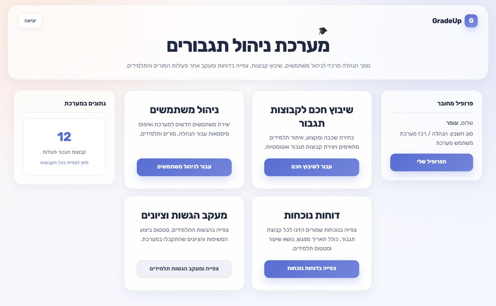

# GradeUp

> A full-stack tutoring management platform for coordinators, teachers, and students.

[](https://www.php.net/)
[](https://www.mysql.com/)
[](https://platform.openai.com/docs/api-reference/responses)
[](#interface)

GradeUp centralizes the day-to-day workflow of a school tutoring program: user management, smart student grouping, assignments, attendance, progress tracking, and communication. The interface is designed in Hebrew with complete right-to-left support and dedicated experiences for each role.

## Interface



## What it demonstrates

- Role-based workflows for coordinators, teachers, and students
- AI-assisted assignment generation through the OpenAI Responses API
- Smart tutoring-group creation based on subject, grade level, and student performance
- Assignment delivery, submission tracking, and result review
- Attendance management and reporting across tutoring sessions
- Transactional email notifications through the Brevo API
- Responsive, accessible RTL layouts for desktop and mobile
- Prepared statements, password hashing, session isolation, and environment-based secrets

## Tech stack

| Layer | Technology |
| --- | --- |
| Backend | PHP 8.2, PDO, MySQLi |
| Database | MySQL 8 |
| Frontend | HTML5, CSS3, vanilla JavaScript, responsive RTL UI |
| AI | OpenAI Responses API |
| Email | Brevo transactional email API |
| Local environment | Docker Compose |

## Run locally

The easiest way to open the complete project is with Docker Desktop:

```bash
git clone https://github.com/omershmul11-netizen/GradeUp.git
cd GradeUp
docker compose up --build
```

Then open [http://localhost:8080/login.php](http://localhost:8080/login.php).

The first start creates a complete synthetic school dataset: 24 students, five teachers, four subjects, active tutoring groups, an assignment, attendance history, and demo accounts:

| Role | Login page | Username | Password |
| --- | --- | --- | --- |
| Coordinator | `/login.php` | `demo.admin` | `GradeUpDemo!2026` |
| Teacher | `/teacher_login.php` | `demo.teacher` | `GradeUpDemo!2026` |
| Student | `/student_login.php` | `demo.student` | `GradeUpDemo!2026` |

The demo data is fictional and intended only for local development. The application replaces the legacy demo password with a secure hash after the first successful login.

To reset the local demo database:

```bash
docker compose down -v
docker compose up --build
```

## Configuration

Core role and database workflows run in the Docker demo without external API keys. Smart grouping always has a deterministic local fallback. Email events are safely recorded in the in-app demo outbox so reviewers can inspect the complete communication workflow without sending real messages.

To enable optional AI features locally, copy the environment template and keep the real key only in the ignored local file:

```bash
cp .env.example .env.local
```

The Docker demo loads `.env.local` at runtime but excludes it from the image and Git. With a private `OPENAI_API_KEY`, grouping and assignment suggestions use the OpenAI Responses API. Without one, the rest of the portfolio demo remains fully usable.

For a traditional PHP deployment, copy the local configuration template and fill it privately:

```bash
cp config.local.example.php config.local.php
```

`config.local.php` is ignored by Git. The same values can also be supplied as server environment variables:

| Variable | Purpose |
| --- | --- |
| `DB_HOST`, `DB_NAME`, `DB_USER`, `DB_PASS` | MySQL connection |
| `OPENAI_API_KEY` | AI assignment and grouping features |
| `BREVO_API_KEY` | Transactional email delivery |
| `MAIL_FROM_EMAIL`, `MAIL_FROM_NAME` | Email sender identity |
| `GRADEUP_DEMO_MODE` | Records notifications in the in-app outbox instead of sending them |

Import `database/schema.sql` for a clean production database. `database/demo_seed.sql` contains only synthetic local-demo data.

For an existing database created before the study-unit curriculum update, run
`database/20260901_add_study_units.sql` once before deploying the updated PHP files.
For an existing database created before the unified PDF worksheet flow, also run
`database/20260904_unified_worksheet.sql` once.

## Project structure

```text
GradeUp/
├── api/                    # JSON endpoints for users, assignments, attendance, and AI
├── assets/                 # Shared responsive styling and browser scripts
├── database/               # Clean schema and synthetic demo seed
├── docs/                   # Portfolio screenshots
├── *_login.php             # Role-specific authentication
├── teacher_*.php           # Teacher workflows
├── student_*.php           # Student workflows
├── smart_matching.php      # Smart tutoring-group workflow
├── compose.yaml            # One-command local environment
└── config.local.example.php
```

## Security

Secrets and production data are intentionally excluded from the repository. See [SECURITY.md](SECURITY.md) for the project security policy.

## Language

The product interface is in Hebrew (`dir="rtl"`). Project documentation is in English so the repository is easy to review internationally.
